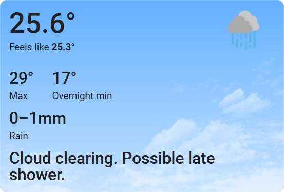

# BOM (Bureau of Meteorology) Weather Card

A [Home Assistant](https://www.home-assistant.io) card designed to display weather information in the style of the [BOM (Bureau of Meteorology) Australia app](https://play.google.com/store/apps/details?id=au.gov.bom.metview&hl=en_AU)



## Features

- All elements have configurable visibility and entity source selection
- To simplify the configuration of the card, most entities are automatically inferred from the selected weather device
- Responds to the `sun.sun` entity for Day / Night mode
- Responds to dark/light mode themes
- Shows different "now / then" temperature min and max values depending on the time of day (this is assumed behavior derived from observing the app and not verified as exactly how the BOM app behaves):
  - 4am -> 12pm (Morning): Min / Max (Last night's min, Today's Max)
  - 12pm -> 6pm (Afternoon): Max / Overnight Min (Today's Max, Tonight's Min)
  - 6pm -> 4am (Evening): Overnight Min / Tomorrow's Max (Tonight's Min, Tomorrow's Max)

## Weather Providers

This card works best when paired with [Bremor's Bureau of Meteorology Custom Component](https://github.com/bremor/bureau_of_meteorology) as a Home Assistant weather provider, but should work fine with other weather providers.

## Date & Time Sensors

To enable the Date and Time features your Home Assistant instance must have both the [Date and Time sensor](https://www.home-assistant.io/integrations/time_date) entities enabled in the Devices & Services -> Integrations.

# Development

This repo is setup to allow you to develop this card locally using a pre-configured Home Assistant instance in a Docker container.

## Prerequisites

- [NodeJS](https://nodejs.org)
- [Docker](https://www.docker.com)

## Recommendations

- [VSCode](https://code.visualstudio.com)
  - [ESLint Extension](https://marketplace.visualstudio.com/items?itemName=dbaeumer.vscode-eslint)
  - [Lit Plugin Extension](https://marketplace.visualstudio.com/items?itemName=runem.lit-plugin)
  - [Prettier Extension](https://marketplace.visualstudio.com/items?itemName=esbenp.prettier-vscode)
  - [Code Spell Checker](https://marketplace.visualstudio.com/items?itemName=streetsidesoftware.code-spell-checker)
  - [Svg Preview](https://marketplace.visualstudio.com/items?itemName=SimonSiefke.svg-preview)

## Getting Started

The following commands pull the repository, install the dependencies, run the Home Assistant Docker container and start the development web server:

```bash
git clone https://github.com/dJPoida/ha-bom-weather-card
cd ha-bom-weather-card
npm i
npm run hass:start
npm run serve
```

## Accessing the Local Dev Site

You can access the local Home Assistant server on [http://localhost:8123](http://localhost:8123). You will need to run through an initial setup in order to access the Home Assistant dashboard.

## Initial Setup of the Home Assistant Docker container

The first time you start the container using `npm run hass:start` and browse to [http://localhost:8123](http://localhost:8123), you will need to perform these steps:

1. Follow through the setup wizard
2. Add the integration for [Bremor's Bureau of Meteorology Custom Component](https://github.com/bremor/bureau_of_meteorology) weather provider
   1. Browse to **[Settings -> Devices and Services](http://localhost:8123/config/integrations/dashboard)**
   2. Click **"+ Add Integration"**
   3. Search for **Bureau of Meteorology**
   4. Follow through the setup wizard to install the weather entities. Ideally select and create ALL entities so that you can test all card features.

## Additional Home Assistant integrations and plugins

Because the Home Assistant is [installed in a Docker Container and not as a Supervised instance](https://www.home-assistant.io/installation/#advanced-installation-methods), many of the configuration features like addons are not available. To access these other features you will need to install and run Home Assistant differently.

You can install all of the below integrations in a single step by using the command `npm run hass:install_integrations` or follow each of the installation steps below.

**Note:** configuration of each individual integration will still be required even if all integrations are installed at the same time

### Bremor's Bureau of Meteorology weather provider

[bremor's Bureau of Meteorology Custom Component](https://github.com/bremor/bureau_of_meteorology) weather provider can be added by following these steps:

1. Ensure Home Assistant is running via `npm run hass:start`
2. Run `npm run hass:install:bureau_of_meteorology`
3. Restart the container `npm run hass:restart`
4. Browse to **[Settings -> Devices and Services](http://localhost:8123/config/integrations/dashboard)**
5. Click **"+ Add Integration"**
6. Search for **Bureau of Meteorology**
7. Follow through the setup wizard to install the weather entities. Ideally select and create ALL entities so that you can test all card features.

### Home Assistant Community Store (HACS)

The [Home Assistant Community Store (HACS)](https://www.hacs.xyz/) can be added by follow these steps:

1. Ensure Home Assistant is running via `npm run hass:start`
2. Run `npm run hass:install:hacs`
3. Restart the container `npm run hass:restart`
4. Browse to **[Settings -> Devices and Services](http://localhost:8123/config/integrations/dashboard)**
5. Click **"+ Add Integration"**
6. Search for **HACS**
7. Follow through the setup wizard.
8. Restart Home Assistant (or the docker container via `npm run hass:restart`)

### Browser Mod

The [Browser Mod integration](https://github.com/thomasloven/hass-browser_mod) allows you to control web browsers within Home Assistant. It can be added by following these steps:

1. Ensure Home Assistant is running via `npm run hass:start`
2. Run `npm run hass:install:browser_mod`
3. Restart the container `npm run hass:restart`
4. Browse to **[Settings -> Devices and Services](http://localhost:8123/config/integrations/dashboard)**
5. Click **"+ Add Integration"**
6. Search for **Browser Mod** and install it
7. Restart Home Assistant (or the docker container via `npm run hass:restart`)
8. Register your browser via http://localhost:8123/browser-mod (Recommended use the browser id `test_browser`)

## Viewing the BOM Weather Card

You can test the bom-weather-card on the [Test Dashboard](http://localhost:8123/test-dashboard).

The build `bom-weather-card.js` will be served by rollup on [http://localhost:4000] and loaded dynamically into Home Assistant.

There is no HMR (hot media reloading), to preview your changes in realtime you will need to refresh the browser manually.

The test dashboard is really just a convenience and an example. It **can't be changed using the HA editor** because it's defined in YAML, so it is best to copy the contents to another dashboard where it can be configured and tested properly.

## Log Verbosity

This project utilizes the [loglevel](https://www.npmjs.com/package/loglevel) library to assist in filtering the logs. To increase the verbosity, either update the `const logLevel = ` line in [rollup.config.js](./rollup.config.js#L15), or run the following command at runtime in the browser to change it dynamically.

```
window.bomWeatherCardLog.setLevel('trace');
window.bomWeatherCardLog.setLevel('debug');
window.bomWeatherCardLog.setLevel('info');
window.bomWeatherCardLog.setLevel('warn');
window.bomWeatherCardLog.setLevel('error');
```

# NPM Scripts

**`npm run build`** \
Build the component for production. The output file ends up in the `./dist` folder.

**`npm run serve`** \
Build, watch and serve the component for active development. Rollup will host a web server on [http://localhost:4000](http://localhost:4000) with `./dist` as the content base, making the `bom-weather-card.js` available for testing in the Home Assistant Docker container. Any changes are compiled immediately and can be reviewed by refreshing the browser.

**`npm run hass:start`** \
Starts the Home Assistant Docker container. This is essentially a wrapper around `docker-compose up -d`. The first time this is executed it may take longer than usual as it downloads the required images.

**`npm run hass:restart`** \
Restarts the Home Assistant Docker container. This is essentially a wrapper around `docker-compose restart`.

**`npm run hass:stop`** \
Stops the Home Assistant Docker container. This is essentially a wrapper around `docker-compose stop`.

**`npm run hass:clean`** \
Reset the Home Assistant Docker instance by cleaning out the `.devcontainer` folder. Make sure the container is not running before executing this command. \
**WARNING**: You will lose all of your previously configured Home Assistant devices and entities

**`npm run hass:install_integrations`** \
Install all of the useful integrations into your Home Assistant Docker container that will be required to develop the BOM Weather Card.

**`npm run hass:install:bureau_of_meteorology`** \
Selectively only install [Bremor's Bureau of Meteorology weather provider](#bremors-bureau-of-meteorology-weather-provider) into your Home Assistant Docker container

**`npm run hass:install:hacs`** \
Selectively only install [Home Assistant Community Store (HACS)](#home-assistant-community-store-hacs) into your Home Assistant Docker container

**`npm run hass:install:browser_mod`** \
Selectively only install [Browser Mod](#browser-mod) into your Home Assistant Docker container

## Troubleshooting

### "Custom element doesn't exist: bom-weather-card"

If you receive this message when debugging the card in Home Assistant, first try refreshing the page. If it persists, it usually means that you haven't started the rollup web server by running `npm run serve`.

### "The edit UI is not available when in YAML mode."

This message appears when you try to edit the Test View in the Test Dashboard. Unfortunately the test dashboard is controlled by the .yaml in this repo and thus can not be edited. Create a new view in the Overview dashboard to manually create instances of this component and experiment with the edit component.

### I can't edit the default dashboard

This dashboard is initially controlled by Home Assistant. To to take control of it:

- Click the pencil (edit) button in the top right
- Select the three dots menu and select "Take Control"

### I can't toggle the Dark and Light mode debug controls

The [Browser Mod integration](#browser-mod) is required for this debug feature to work. Make sure it is installed and configured.

# Field and Data source mapping and inference

For weather entities and attributes that are not explicitly defined by the user, there is a system under
the hood which infers entities and attributes from other defined configurations.

For example, defining the Weather Device, will infer the name of the summary weather entity from the weather device.
This is purely a convenience feature to prevent the user from having to explicitly set each of the entities in the
configuration. However, it's mainly designed around the entities exposed by default from [Bremor's Bureau of Meteorology Custom Component](https://github.com/bremor/bureau_of_meteorology).

All of the rules are defined in [inferred-entity-rules.const.ts](./src/constants/inferred-entity-rules.const.ts).

## Summary inference rules

- Summary Weather Entity -> `summary_weather_entity_id` -> `weather.%device_name%`
- Current Temp -> `current_temp_entity_id` -> `summary_weather_entity[attribute: temperature]`
- Feels Like Temp -> `feels_like_temp_entity_id`
- Weather Condition -> `weather_condition_entity_id` -> `weather.%device_name%`
- Sun -> `sun_entity_id` -> `sun.sun`
- Time -> `time_entity_id` -> `sensor.time`
- Date -> `date_entity_id` -> `sensor.date`
- Now/Later - Now Temperature -> `now_later_now_temp_entity_id` -> `sensor.%device_name%_now_temp_now`
- Now/Later - Now Label -> `now_later_now_label_entity_id` -> `sensor.%device_name%_now_now_label`
- Now/Later - Later Temperature -> `now_later_later_temp_entity_id` -> `sensor.%device_name%_now_temp_later`
- Now/Later - Later Label -> `now_later_later_label_entity_id` -> `sensor.%device_name%_now_later_label`
- Warning Count -> `warning_count_entity_id` -> `sensor.%device_name%_warnings`

# Links and References:

- [custom-card-helpers Documentation](https://custom-cards.github.io/custom-card-helpers/index.html)
- [Home Assistant Frontend Component Source](https://github.com/home-assistant/frontend/tree/dev/src/components)
- [Bremor's Bureau of Meteorology Custom Component](https://github.com/bremor/bureau_of_meteorology)

# Acknowledgements

- Thanks to [Makin-Things for the weather icons](https://github.com/Makin-Things/weather-icons) used in this project.
- Thanks to [Bremor's Bureau of Meteorology Custom Component](https://github.com/bremor/bureau_of_meteorology) for being the inspiration behind making this front end component

# TODO

- Implement Tests
- Move the TODO list to [Issues](https://github.com/dJPoida/ha-bom-weather-card/issues)
- Split the README.md into smaller pieces aimed at contextual guidance for installation, development and contribution etc...
- Find a way to use strict typing for Home Assistant Lit Components and remove the `no-unknown-tag-name` lit-plugin rule.
- Limit the Entity Picker to only Weather Entities
- Decouple the hass element from the card and build a state manager to better enable automated testing
- Time/Date section
  - AM/PM vs 24 Hour time selection
  - Allow date format specification (or use HASS locale by default)
- Styles
  - Allow removing the card border
  - Allow not using full color background
  - Implement the transparent images that represent cloud / storms etc...
- [Publish on HACS](https://www.hacs.xyz/docs/publish/)
